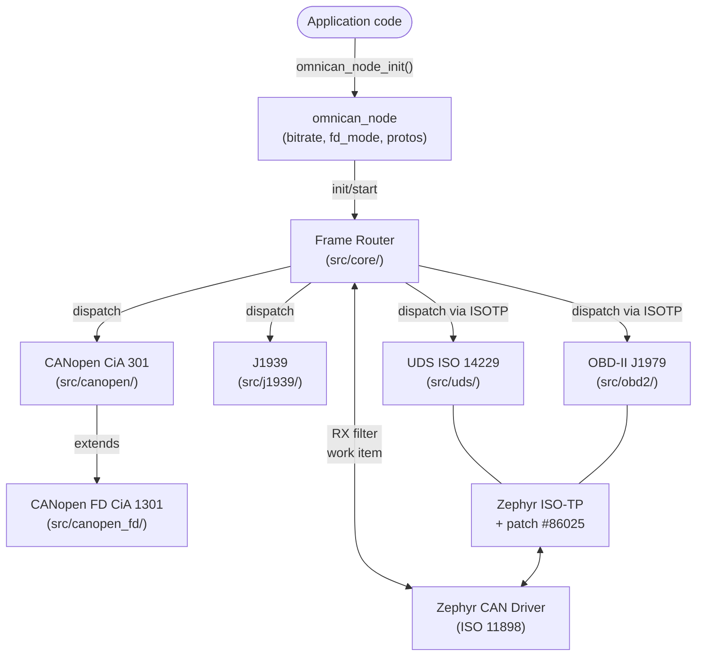
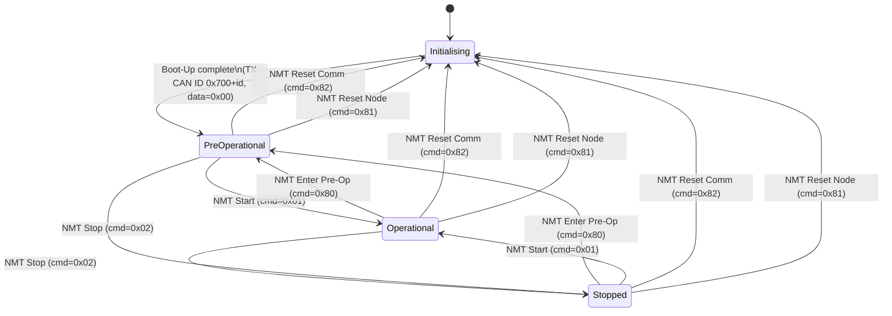
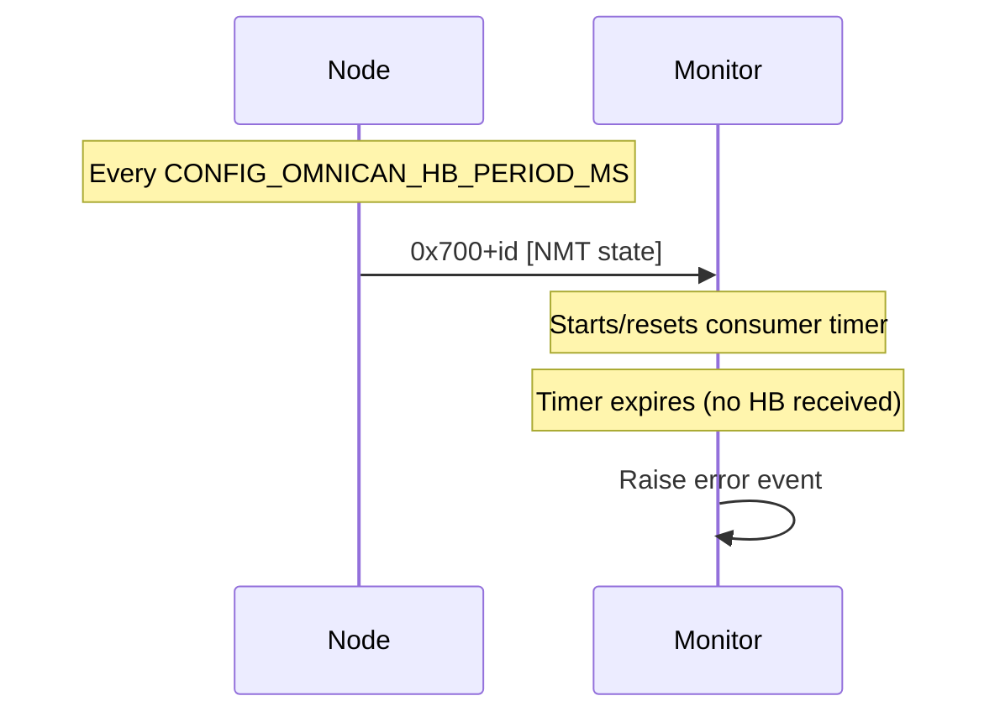
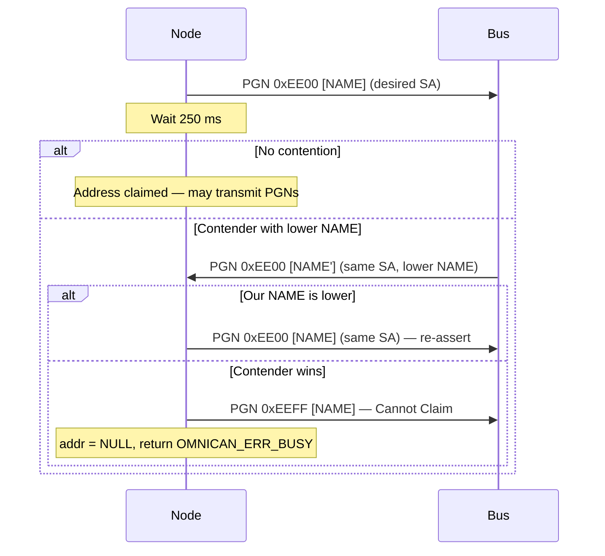
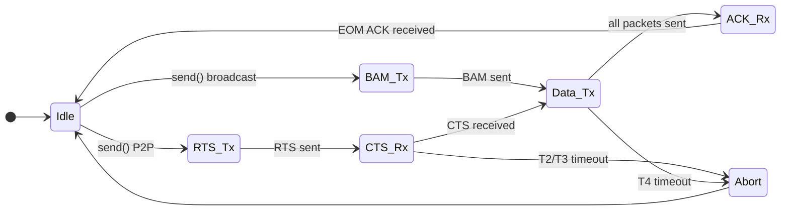
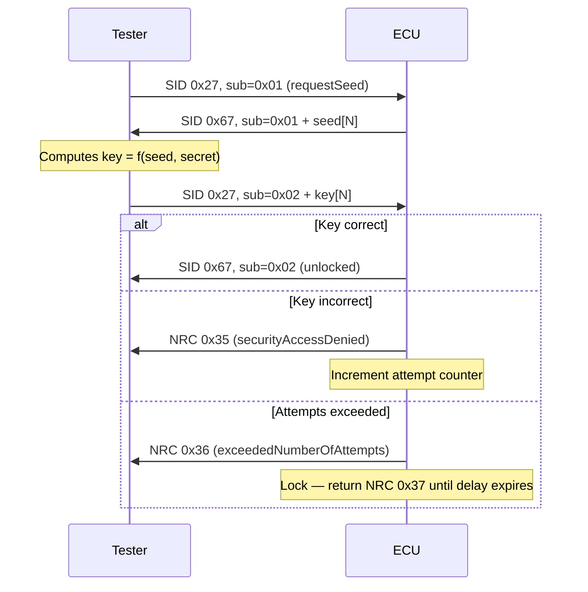
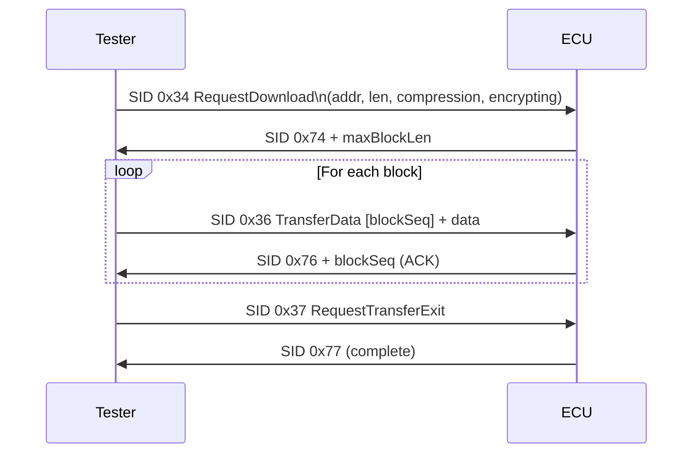
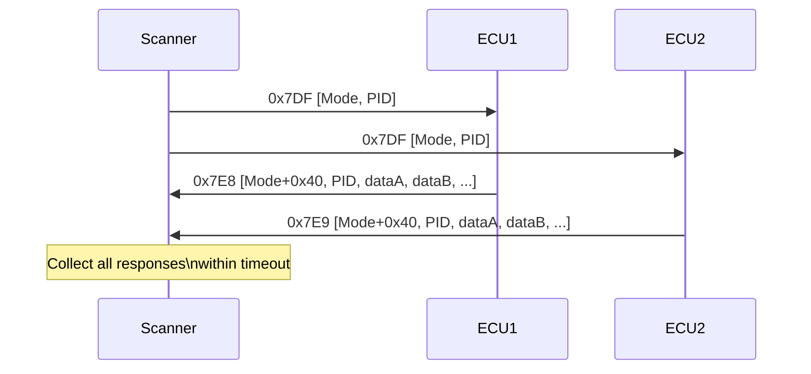
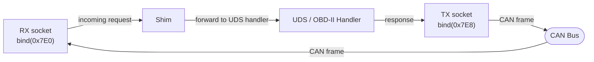

# Architecture — OmniCAN

**Version**: 0.1.0 | **License**: Apache-2.0 | **Target**: Zephyr RTOS v3.7.0

## Overview
OmniCAN is a unified, multi-protocol CAN stack delivered as a Zephyr west
module. It provides a single shared node context and central frame router
that dispatches to independently selectable protocol modules. Every protocol
is guarded by a Kconfig symbol so unused modules compile to zero.

Protocol implementation is phased:
- **Phase 1** — CANopen CiA 301 (ported from BitConcepts/CANopenNode fork)
- **Phase 2** — SAE J1939 (address claiming, PGN routing, TP/ETP)
- **Phase 3** — ISO 14229 / UDS (over Zephyr ISO-TP + issue #86025 patch)
- **Phase 4** — SAE J1979 / OBD-II (over Zephyr ISO-TP)
- **Phase 5** — CANopen FD CiA 1301 (extends Phase 1)

## Components

### Core Node
- Provide `omnican_node_init()` to bind a Zephyr CAN device, set bitrate, and enable FD mode
- Return `OMNICAN_ERR_NODEV` from `omnican_node_init()` when the CAN device is not ready
- Define `omnican_proto_t` bitmask with one bit per protocol (CANOPEN, J1939, UDS, OBD2)
- Define `omnican_err_t` with codes OK, INVAL, NODEV, NOMEM, TIMEOUT, BUSY, PROTO, UNSUPPORTED, IO
- Register as a Zephyr west module via `zephyr/module.yml` so `west build` adds include/ to the build path
- Be buildable against Zephyr v3.7.0 with no patches to Zephyr itself

### Frame Router
- Register exactly one CAN receive filter per enabled protocol
- Dispatch received frames to the correct protocol handler without blocking the CAN ISR
- Use a Zephyr system workqueue for all protocol callback dispatch
- Auto-enable via CONFIG_OMNICAN_FRAME_ROUTER when any protocol is active

### CANopen CiA 301
- Implement the NMT state machine with states Initialising, Pre-Operational, Operational, and Stopped per CiA 301
- Transmit a Boot-Up message (NMT state 0x00) on transition from Initialising to Pre-Operational
- Respond to NMT master commands (Start, Stop, Pre-Operational, Reset Node, Reset Communication) on CAN ID 0x000
- Implement an SDO server supporting expedited, segmented, and block transfer modes per CiA 301
- Return SDO abort code 0x05040000 on SDO timeout
- Support TPDO and RPDO with event-driven and synchronisation-triggered transmission modes
- Support compile-time PDO mappings via the Object Dictionary
- Produce Emergency messages (CAN ID 0x80 + node_id) with 16-bit error code and 8-byte error register per CiA 301
- Produce Heartbeat messages at a Kconfig-configurable interval (default 1000 ms) per CiA 301
- Support Heartbeat consumer monitoring of remote nodes with error event on timeout
- Represent the Object Dictionary as a static C array generated from an OD descriptor with no heap allocation
- Write recommended delay to next `omnican_canopen_process()` call in microseconds via `*next_us`
- Run the CANopen process loop in a dedicated Zephyr thread with configurable stack size and priority

### J1939
- Use 29-bit extended CAN identifiers and reject 11-bit standard ID frames
- Implement the address-claiming procedure per J1939/81 with 250 ms contention window and 64-bit NAME priority
- Prevent PGN transmission until address claiming succeeds
- Return OMNICAN_ERR_BUSY and set addr to NULL when address claiming fails
- Support a static PGN routing table populated via `omnican_j1939_register_pgn()` with callback and user-data
- Invoke PGN callbacks from the system workqueue with source address, data pointer, and length
- Implement J1939 Transport Protocol (TP) for 9-1785 byte messages using BAM and CMDT modes
- Implement Extended Transport Protocol (ETP) for messages larger than 1785 bytes
- Maintain TP/ETP session state in static context with configurable maximum simultaneous sessions

### UDS ISO 14229
- Use Zephyr ISO-TP for all UDS message transport with ISOTP patch when CONFIG_OMNICAN_ISOTP_PATCH=y
- Implement DiagnosticSessionControl (SID 0x10) and enforce service availability per active session
- Maintain an S3 timer (default 5000 ms) and revert to Default session on expiry
- Reset the S3 timer on TesterPresent (SID 0x3E)
- Support SID 0x10 DiagnosticSessionControl
- Support SID 0x11 ECUReset with hardReset, softReset, and keyOffOnReset sub-functions
- Support SID 0x22 ReadDataByIdentifier
- Support SID 0x27 SecurityAccess with application-supplied seed/key callback
- Support SID 0x28 CommunicationControl
- Support SID 0x2E WriteDataByIdentifier
- Support SID 0x31 RoutineControl with start, stop, and requestResults
- Support SID 0x34 RequestDownload
- Support SID 0x36 TransferData
- Support SID 0x37 RequestTransferExit
- Support SID 0x85 ControlDTCSetting
- Return NRC 0x11 (serviceNotSupported) for unregistered SIDs
- Never use a hardcoded SecurityAccess seed/key algorithm; always use an application callback
- Lock the session and return NRC 0x36 after exceeding CONFIG_OMNICAN_UDS_MAX_AUTH_ATTEMPTS failed SecurityAccess attempts

### OBD-II J1979
- Transmit PID requests on CAN ID 0x7DF and collect responses from 0x7E8-0x7EF within configurable timeout
- Support OBD-II service modes 0x01 through 0x09
- Provide callback-based non-blocking PID request/response model
- Support Mode 0x01 PIDs: 0x00 (supported), 0x01 (monitor status), 0x04 (engine load), 0x05 (coolant), 0x0C (RPM), 0x0D (speed), 0x11 (throttle)

### CANopen FD CiA 1301
- Extend CANopen module with CiA 1301 FD features; require CONFIG_OMNICAN_CANOPEN=y and CONFIG_CAN_FD_MODE=y
- Support CAN FD data payloads of up to 64 bytes for higher-throughput PDO transfers
- Maintain backward compatibility with classical 8-byte CANopen nodes when FD is not negotiated

### ISOTP Patch
- Implement a workaround for Zephyr issue #86025 using separate TX/RX socket contexts with a forwarding shim
- Default CONFIG_OMNICAN_ISOTP_PATCH to y when CONFIG_OMNICAN_UDS or CONFIG_OMNICAN_OBD2 is enabled

### Memory and Threading
- Never use dynamic heap allocation (k_malloc, malloc); all state statically allocated or via net_buf pools
- Handle CAN frame data via Zephyr net_buf from a pool sized by CONFIG_OMNICAN_NET_BUF_COUNT (default 16)
- All protocol context structures shall be opaque to the caller but caller-allocated
- All protocol handlers execute in a Zephyr workqueue context, not the CAN ISR

## Normative References
See `docs/STANDARDS.md` for the complete standards registry with edition numbers.
Primary normative references per protocol:
- **CANopen**: CiA 301 v4.2.0 (Phase 1), CiA 1301 v1.0.0 (Phase 5)
- **J1939**: SAE J1939/21 DEC2010, SAE J1939/81 MAY2003
- **UDS**: ISO 14229-1:2020, ISO 14229-3:2012
- **OBD-II**: SAE J1979 FEB2012, ISO 15765-4:2021
- **ISO-TP**: ISO 15765-2:2016
- **CAN physical**: ISO 11898-1:2015 (via Zephyr CAN driver)

## Design Principles
1. **Zero-overhead when disabled** — every module is behind `IS_ENABLED()` guards; disabled protocols produce no code or data.
2. **Static allocation only** — no heap (`malloc`/`free`). All protocol contexts are caller-allocated. Frame buffers use Zephyr `net_buf` pools.
3. **Zephyr-native** — uses Zephyr CAN driver API, `net_buf`, logging, Kconfig, and the workqueue/thread model throughout. No POSIX shims.
4. **Single node context** — `struct omnican_node` is the root anchor; all protocol sub-contexts hold a pointer back to it.
5. **Standards-faithful** — each protocol module traces directly to the normative standard; any deviation is documented in LEDGER.md.
6. **Apache-2.0** — all source files carry SPDX headers.

## Repository Structure
```
omnican/
  include/omnican/   Public C headers — one per module
  src/core/          Frame router (auto-enabled by any protocol)
  src/canopen/       CANopen CiA 301
  src/canopen_fd/    CANopen FD CiA 1301
  src/j1939/         SAE J1939
  src/uds/           ISO 14229 / UDS
  src/obd2/          SAE J1979 / OBD-II
  src/isotp_patch/   Zephyr ISOTP #86025 workaround
  CMakeLists.txt     Module root — dispatches to src/ subdirs via Kconfig
  Kconfig            All CONFIG_OMNICAN_* symbols
  west.yml           Manifest: Zephyr v3.7.0, optional CANopenNode ref
  zephyr/module.yml  West module descriptor
  docs/STANDARDS.md  Normative standards registry with edition pins
```

## System Architecture Diagram



## Core Node Context

`struct omnican_node` (defined in `include/omnican/core.h`) is the shared
anchor for all protocol instances:

```c
struct omnican_node {
    const struct device *can_dev;  /* Zephyr CAN device              */
    uint32_t             bitrate;  /* Nominal bitrate in kbps        */
    bool                 fd_mode;  /* True when CAN FD active        */
    omnican_proto_t      protos;   /* Bitmask of initialised protos  */
};
```

**REQ** The system shall provide `omnican_node_init()` to bind a Zephyr CAN
device, set bitrate, and enable FD mode, returning `OMNICAN_ERR_NODEV` if
the device is not ready.

**REQ** The system shall define a bitmask type `omnican_proto_t` with one bit
per protocol (`CANOPEN`, `J1939`, `UDS`, `OBD2`) so the active protocol set
can be inspected at runtime.

**REQ** The system shall define `omnican_err_t` with the codes `OMNICAN_OK`,
`OMNICAN_ERR_INVAL`, `OMNICAN_ERR_NODEV`, `OMNICAN_ERR_NOMEM`,
`OMNICAN_ERR_TIMEOUT`, `OMNICAN_ERR_BUSY`, `OMNICAN_ERR_PROTO`,
`OMNICAN_ERR_UNSUPPORTED`, `OMNICAN_ERR_IO`.

## Frame Router (`src/core/`)

The frame router is enabled automatically when any protocol is active
(`CONFIG_OMNICAN_FRAME_ROUTER`, defaulting to `y`). It:

1. Registers a Zephyr `CAN_MSGQ_DEFINE` or CAN RX callback per enabled protocol.
2. On each received frame, inspects the CAN ID to determine the owning protocol.
3. Dispatches to the appropriate protocol handler via `k_work_submit()`.
4. Runs dispatch in a Zephyr system workqueue callback to keep the CAN ISR short.

### Dispatch Table

| Protocol | CAN filter | ID range | Frame type |
|---|---|---|---|
| CANopen | Mask filter | 0x000–0x7FF | 11-bit standard |
| J1939 | Accept-all extended | 29-bit extended | 29-bit extended only |
| UDS/OBD-II | ISO-TP layer | 0x7DF, 0x7E0–0x7EF | 11-bit standard |

CANopen and J1939 use non-overlapping ID spaces (11-bit vs 29-bit) so they can
coexist on the same physical CAN bus without filter conflicts. UDS/OBD-II
operate through the Zephyr ISO-TP subsystem, which manages its own filters.

**REQ** The frame router shall register exactly one CAN receive filter per
enabled protocol and dispatch received frames to the correct protocol handler
without blocking the CAN ISR.

**REQ** The frame router shall use a Zephyr system workqueue for all protocol
callback dispatch so that protocol handlers may use kernel primitives (mutexes,
k_sleep, etc.).

## Phase 1 — CANopen (CiA 301) (`src/canopen/`)

**Normative reference**: CiA 301 v4.2.0. See `docs/STANDARDS.md §2`.

### Source
Port and rearchitecture of the `BitConcepts/CANopenNode` fork, incorporating
all fixes from nine iterative audit rounds. The implementation is Zephyr-native
and does not depend on upstream CANopenNode runtime conventions.

### NMT State Machine (CiA 301 §7.3.2.2)



NMT command frames: CAN ID 0x000, 2 bytes: `[cmd, node_id]`. node_id=0 targets all.

**REQ** The CANopen module shall implement the NMT state machine with states
Initialising, Pre-Operational, Operational, and Stopped per CiA 301.

**REQ** The CANopen module shall transmit a Boot-Up message (NMT state 0x00)
on transition from Initialising to Pre-Operational.

**REQ** The CANopen module shall respond to NMT master commands (Start, Stop,
Enter Pre-Operational, Reset Node, Reset Communication) received on CAN ID 0x000.

### SDO Server (CiA 301 §7.2.4)

SDO provides confirmed object dictionary access. Three transfer modes:

| Mode | When | Max data |
|---|---|---|
| Expedited | ≤ 4 bytes | 1–4 bytes in one exchange |
| Segmented | 5–N bytes | 7 bytes per segment, N segments |
| Block transfer | Large data | Up to 127 segments per block, confirmed per block |

SDO frame layout (CAN ID 0x600+id for request, 0x580+id for response):

```
Byte 0: Command specifier (cs)
Byte 1: Index LSB
Byte 2: Index MSB
Byte 3: Sub-index
Bytes 4–7: Data (expedited) or segment count / block size
```

**REQ** The CANopen module shall implement an SDO server supporting expedited,
segmented, and block transfer modes per CiA 301.

**REQ** The SDO server shall return an SDO abort (0x05040000 — SDO timeout)
if no response is received within the configured timeout.

### PDO (CiA 301 §7.2.3)

PDOs carry process data without overhead. Transmission types (OD 0x1800, sub 2):

| Type | Value | Description |
|---|---|---|
| Event-driven (async) | 0xFF | Transmitted on data change or application trigger |
| Synchronous | 0x01–0xF0 | Transmitted every N SYNC messages |
| Synchronous (RTR) | 0xFC | Transmitted after N SYNCs, RTR-triggered |
| Event-driven (RTR) | 0xFD | Transmitted on RTR |
| Manufacturer | 0x00 | Synchronous, acyclic |

PDO mapping (OD 0x1A00/0x1600): each sub-entry encodes `[index(16) | sub(8) | bits(8)]`.

**REQ** The CANopen module shall support Transmit PDO (TPDO) and Receive PDO
(RPDO) with event-driven and synchronisation-triggered transmission modes.

**REQ** PDO mappings shall be configurable at compile time via the Object
Dictionary.

### Emergency (CiA 301 §7.2.7)

Emergency messages: CAN ID `0x80 + node_id`, 8-byte payload:

```
Bytes 0–1: Emergency error code (16-bit)
Byte  2:   Error register (OD 0x1001)
Bytes 3–7: Manufacturer-specific data
```

Error register bits: generic (0), current (1), voltage (2), temperature (3),
communication (4), device profile (5), reserved (6), manufacturer (7).

**REQ** The CANopen module shall produce Emergency messages (CAN ID
`0x80 + node_id`) on internal error events with a 16-bit error code and
8-byte error register per CiA 301.

### Heartbeat (CiA 301 §7.2.8)

Heartbeat producer: CAN ID `0x700 + node_id`, 1-byte NMT state value.
Producer interval: OD 0x1017 (ms). Consumer monitoring: OD 0x1016.



**REQ** The CANopen module shall produce Heartbeat messages at a
Kconfig-configurable interval (default 1000 ms) per CiA 301.

**REQ** The CANopen module shall support Heartbeat consumer monitoring of
configured remote nodes and raise an error event on timeout.

### Object Dictionary Structure

The OD is a static `const struct od_entry od_table[]` array generated from a
descriptor file (compatible with EDS/CiA 306). Each entry:

```c
struct od_entry {
    uint16_t index;
    uint8_t  sub;
    uint8_t  type;      /* UINT8, UINT16, UINT32, ... */
    uint32_t attr;      /* RO, RW, WO, const */
    void    *data;      /* pointer to .data section variable */
    size_t   size;
};
```

**REQ** The Object Dictionary shall be represented as a static C array
generated from an OD descriptor, with no runtime heap allocation.

### API
```c
int  omnican_canopen_init(struct omnican_node *, uint8_t node_id);
int  omnican_canopen_start(struct omnican_node *);
void omnican_canopen_stop(struct omnican_node *);
void omnican_canopen_process(struct omnican_node *, uint32_t elapsed_us,
                              uint32_t *next_us);
```

`omnican_canopen_process()` drives: heartbeat timer, SDO segmented timeouts,
TPDO event timers, SYNC period counter, Heartbeat consumer watchdogs.

**REQ** `omnican_canopen_process()` shall write the recommended delay to the
next call (in microseconds) into `*next_us` so callers can schedule correctly.

**REQ** The CANopen process loop shall run in a dedicated Zephyr thread with
a configurable stack size (`CONFIG_OMNICAN_CANOPEN_THREAD_STACK_SIZE`,
default 2048 bytes) and priority (`CONFIG_OMNICAN_CANOPEN_THREAD_PRIO`,
default 7).

## Phase 2 — SAE J1939 (`src/j1939/`)

**Normative references**: SAE J1939/21 DEC2010 (TP/ETP), SAE J1939/81 MAY2003
(address claiming). See `docs/STANDARDS.md §3`.

### CAN Identifier Format (J1939/21 §5.2)

J1939 uses 29-bit extended CAN identifiers exclusively.

```
Bits: 28          26 25  24 23       16 15        8 7          0
      ┌─────────────┬──┬──┬───────────┬────────────┬────────────┐
      │ Priority(3) │R │DP│    PF(8)  │   PS(8)    │   SA(8)   │
      └─────────────┴──┴──┴───────────┴────────────┴────────────┘
```

- PF < 0xF0 → peer-to-peer: PS = Destination Address (DA)
- PF ≥ 0xF0 → broadcast: PS = Group Extension (GE); PGN includes GE
- PGN = (DP << 17) | (PF << 8) | (GE if PF ≥ 0xF0 else 0)

**REQ** The J1939 module shall use 29-bit extended CAN identifiers and shall
reject frames with 11-bit standard IDs.

### 64-bit NAME Field (J1939/81 §4.2.2)

```
Bit: 63        56 55      52 51      49 48   42 41     36 35   34 33      21 20       11 10        0
     ┌──────────┬──────────┬──────────┬───────┬─────────┬──────┬────────────┬───────────┬───────────┐
     │ Identity │ Mfr Code │  Ecu     │  Func │  Func   │ Rsv  │   Dev Cls  │ Veh Sys   │ Arb Addr  │
     │ Number   │  (11)    │ Instance │  Inst │  (8)    │  (1) │   Inst(4)  │  (7)      │ Cap (1)   │
     │  (21)    │          │  (3)     │  (5)  │         │      │            │           │           │
     └──────────┴──────────┴──────────┴───────┴─────────┴──────┴────────────┴───────────┴───────────┘
```

Lower NAME value = higher priority in address contention.

### Address Claiming Flow (J1939/81 §4.2)



**REQ** The J1939 module shall implement the address-claiming procedure per
J1939/81: transmit a Claim Address message, monitor for contention for 250 ms,
and resolve conflicts using the 64-bit NAME priority.

**REQ** A J1939 node shall not transmit any PGN until address claiming succeeds.

**REQ** If address claiming fails (higher-priority NAME wins), the module shall
report `OMNICAN_ERR_BUSY` and set `addr = OMNICAN_J1939_ADDR_NULL`.

### PGN Routing Table

The routing table is a static array of `{ pgn, callback, user_data }` entries,
limited to `CONFIG_OMNICAN_J1939_MAX_PGN_ENTRIES` (default 16).
Incoming frames are matched by PGN. Unregistered PGNs are silently dropped.

**REQ** The J1939 module shall support a static PGN routing table populated
via `omnican_j1939_register_pgn()` with a callback and user-data pointer.

**REQ** PGN callbacks shall be invoked from the system workqueue with source
address, data pointer, and length.

### Transport Protocol (J1939/21 §5.10)

BAM (Broadcast Announce Message) is used for broadcast PGNs.
CMDT (Connection-Managed Data Transfer) is used for peer-to-peer PGNs.



ETP follows the same pattern with extended RTS/CTS frames for >1785-byte messages.
TP/ETP sessions use statically allocated `struct j1939_tp_session` contexts.

**REQ** The J1939 module shall implement J1939 Transport Protocol (TP) for
multi-packet messages of 9–1785 bytes using BAM and CMDT modes.

**REQ** The J1939 module shall implement Extended Transport Protocol (ETP) for
messages larger than 1785 bytes (up to ~117 MB), subject to Zephyr memory
constraints.

**REQ** TP/ETP session state shall be maintained in static context with a
configurable maximum number of simultaneous sessions (`CONFIG_OMNICAN_J1939_MAX_SESSIONS`).

### API
```c
int omnican_j1939_init(struct omnican_j1939_node *, struct omnican_node *,
                       const uint8_t name[8]);
int omnican_j1939_claim_address(struct omnican_j1939_node *,
                                omnican_j1939_addr_t desired, uint32_t timeout_ms);
int omnican_j1939_send(struct omnican_j1939_node *, omnican_j1939_pgn_t pgn,
                       omnican_j1939_addr_t dst, const uint8_t *data, size_t len);
int omnican_j1939_register_pgn(struct omnican_j1939_node *, omnican_j1939_pgn_t,
                               omnican_j1939_rx_cb_t, void *user_data);
```

Return codes: `OMNICAN_OK`, `OMNICAN_ERR_BUSY` (address conflict),
`OMNICAN_ERR_TIMEOUT` (TP/ETP timeout), `OMNICAN_ERR_INVAL`, `OMNICAN_ERR_NOMEM`.

## Phase 3 — ISO 14229 / UDS (`src/uds/`)

**Normative references**: ISO 14229-1:2020, ISO 14229-3:2012, ISO 15765-2:2016.
See `docs/STANDARDS.md §4` and `§6`.

### Transport

UDS uses Zephyr's ISO-TP subsystem (ISO 15765-2) as transport.
Physical addressing: tester `0x7E0` → ECU `0x7E8` (configurable via
`struct omnican_uds_server_cfg { .rx_can_id, .tx_can_id, .ecu_addr }`).

**REQ** The UDS module shall use Zephyr ISO-TP for all message transport and
shall apply the ISOTP patch (see §ISOTP Patch) when `CONFIG_OMNICAN_ISOTP_PATCH=y`.

### Session State Machine (ISO 14229-1 §7.5)

```mermaid
stateDiagram-v2
    [*] --> Default
    Default --> Programming : SID 0x10 sub=0x02\n(enters Programming)
    Default --> Extended : SID 0x10 sub=0x03
    Programming --> Default : SID 0x10 sub=0x01\nor S3 timeout (5000 ms)
    Extended --> Default : SID 0x10 sub=0x01\nor S3 timeout (5000 ms)
    Programming --> Extended : SID 0x10 sub=0x03
    note right of Programming : SecurityAccess available\nSID 0x34/0x36/0x37 available
    note right of Extended : SID 0x28, 0x85 available\nSecurityAccess available
```

S3 timer is reset by any correctly received request (including TesterPresent).

**REQ** The UDS server shall implement DiagnosticSessionControl (SID 0x10)
and enforce service availability per active session.

**REQ** The UDS server shall maintain an S3 timer (default 5000 ms) and revert
to Default session on expiry when not in Default session.

**REQ** The TesterPresent service (SID 0x3E) shall reset the S3 timer.

### SecurityAccess Exchange (ISO 14229-1 §10.4)



The seed/key algorithm is **never** hardcoded in OmniCAN — it is always
supplied by the application via a callback.

**REQ** The UDS server shall support the following SIDs:
- 0x10 DiagnosticSessionControl
- 0x11 ECUReset (hardReset 0x01, softReset 0x03, keyOffOnReset 0x02)
- 0x22 ReadDataByIdentifier
- 0x27 SecurityAccess (seed/key mechanism, app-provided)
- 0x28 CommunicationControl
- 0x2E WriteDataByIdentifier
- 0x31 RoutineControl (start 0x01, stop 0x02, requestResults 0x03)
- 0x34 RequestDownload
- 0x36 TransferData
- 0x37 RequestTransferExit
- 0x3E TesterPresent
- 0x85 ControlDTCSetting

**REQ** Unregistered SIDs shall return Negative Response Code (NRC) 0x11
(serviceNotSupported).

**REQ** SecurityAccess (SID 0x27) shall use an application-supplied
seed-generation and key-validation callback, never a hardcoded algorithm.

**REQ** After exceeding `CONFIG_OMNICAN_UDS_MAX_AUTH_ATTEMPTS` (default 3)
failed SecurityAccess attempts, the server shall lock the session and return
NRC 0x36 (exceededNumberOfAttempts).

### Data Transfer Flow (ISO 14229-1 §14)



### API
```c
int omnican_uds_server_init(struct omnican_uds_server *srv,
                            struct omnican_node *base,
                            const struct omnican_uds_server_cfg *cfg);
int omnican_uds_register_service(struct omnican_uds_server *srv,
                                 uint8_t sid,
                                 omnican_uds_service_cb_t cb,
                                 void *user_data);
```

Service callback signature:
```c
typedef int (*omnican_uds_service_cb_t)(
    uint8_t sid,
    const uint8_t *req, size_t req_len,
    uint8_t *resp, size_t *resp_len,
    void *user_data
); /* returns 0 = positive response; negative = NRC */
```

## Phase 4 — SAE J1979 / OBD-II (`src/obd2/`)

**Normative references**: SAE J1979 FEB2012, ISO 15765-4:2021.
See `docs/STANDARDS.md §5`.

### Transport

OBD-II uses Zephyr ISO-TP with ISO 15765-4 (OBD on CAN) parameters.
Standard IDs: 0x7DF (broadcast request), 0x7E8–0x7EF (ECU responses).



**REQ** The OBD-II client shall transmit PID requests on CAN ID 0x7DF and
collect responses from 0x7E8–0x7EF within a configurable timeout.

### Mode 0x01 PID Response Format (J1979 §5.3)

Response bytes: `[Mode+0x40, PID, dataA, dataB, dataC, dataD]`

Key PIDs and decode formulas:

| PID | Bytes | Formula | Unit |
|---|---|---|---|
| 0x04 | 1 | A × 100 / 255 | % load |
| 0x05 | 1 | A − 40 | °C coolant |
| 0x0C | 2 | (256A + B) / 4 | RPM |
| 0x0D | 1 | A | km/h |
| 0x11 | 1 | A × 100 / 255 | % throttle |

**REQ** The OBD-II client shall support service modes 0x01 through 0x09.

**REQ** The OBD-II client shall provide a callback-based response model:
`omnican_obd2_request_pid()` is non-blocking; the registered callback fires
when a response arrives or the request times out.

**REQ** The OBD-II client shall support the following Mode 0x01 PIDs at
minimum: 0x00 (supported PIDs), 0x01 (monitor status), 0x04 (engine load),
0x05 (coolant temp), 0x0C (RPM), 0x0D (vehicle speed), 0x11 (throttle).

### API
```c
int omnican_obd2_client_init(struct omnican_obd2_client *client,
                             struct omnican_node *base);
int omnican_obd2_request_pid(struct omnican_obd2_client *client,
                             uint8_t mode, uint8_t pid,
                             omnican_obd2_response_cb_t cb,
                             void *user_data,
                             uint32_t timeout_ms);
```

Response callback: `void cb(uint8_t mode, uint8_t pid, const uint8_t *data, size_t len, void *user_data)`

## Phase 5 — CANopen FD CiA 1301 (`src/canopen_fd/`)

**Normative reference**: CiA 1301 v1.0.0. See `docs/STANDARDS.md §2.4`.

CANopen FD extends Phase 1 with CAN FD capabilities:

| Feature | Classical CANopen | CANopen FD |
|---|---|---|
| Max PDU size | 8 bytes | 64 bytes |
| Bit rate (data phase) | ≤ 1 Mbit/s | ≤ 8 Mbit/s (hardware-dependent) |
| SDO block transfer | Up to 7 bytes/segment | Up to 60 bytes/segment |
| PDO mapping | Up to 8 × 1-byte signals | Up to 8 × 8-byte signals |
| Backward compat | — | Negotiated; falls back to 8-byte |

**REQ** The CANopen FD module shall extend the CANopen module (Phase 1) with
CiA 1301 FD-specific features and shall require `CONFIG_OMNICAN_CANOPEN=y` and
`CONFIG_CAN_FD_MODE=y`.

**REQ** CANopen FD frames shall support data payloads of up to 64 bytes,
enabling higher-throughput PDO transfers than classical CANopen.

**REQ** The CANopen FD module shall remain backward-compatible: a node
configured for FD shall be able to communicate with classical CANopen nodes
using 8-byte frames when FD is not negotiated.

## ISOTP Patch (`src/isotp_patch/`)

Zephyr issue [#86025](https://github.com/zephyrproject-rtos/zephyr/issues/86025):
the Zephyr ISO-TP subsystem does not allow binding and transmitting on the same
CAN ID within a single socket context. Standard UDS physical addressing
(e.g. tester 0x7E0 / ECU 0x7E8) requires both.

**Workaround design**:



Two separate ISO-TP socket contexts are used: one bound for receive on the request
ID, one for transmit on the response ID. The shim bridges them.

**REQ** When `CONFIG_OMNICAN_ISOTP_PATCH=y`, the module shall implement a
workaround that uses separate TX and RX socket contexts with a forwarding shim
so that UDS and OBD-II can operate on standard physical addresses.

**REQ** `CONFIG_OMNICAN_ISOTP_PATCH` shall default to `y` when either
`CONFIG_OMNICAN_UDS` or `CONFIG_OMNICAN_OBD2` is enabled.

## Thread and Execution Model

```
CAN ISR  (kernel context — runs at IRQ level)
  └─ Zephyr CAN driver → RX callback
        └─ k_work_submit() → System workqueue (cooperative thread)
              └─ Frame router
                    ├─ CANopen handler  (CAN ID 0x000–0x7FF)
                    ├─ J1939 handler   (extended 29-bit IDs)
                    ├─ ISO-TP RX shim  (0x7DF, 0x7E0–0x7E7)
                    └─ ISO-TP responses (0x7E8–0x7EF)

CANopen thread (dedicated, CONFIG_OMNICAN_CANOPEN_THREAD_PRIO = 7)
  └─ omnican_canopen_process() loop
        ├─ Heartbeat timer tick
        ├─ SDO timeout watchdog
        ├─ TPDO event timers
        └─ Heartbeat consumer watchdogs
```

**REQ** All protocol handlers shall execute in a Zephyr workqueue context (not
the CAN ISR) so they may safely use kernel synchronisation primitives.

**REQ** The CANopen process loop shall run in a dedicated Zephyr thread with
a configurable stack size (`CONFIG_OMNICAN_CANOPEN_THREAD_STACK_SIZE`,
default 2048 bytes) and priority (`CONFIG_OMNICAN_CANOPEN_THREAD_PRIO`,
default 7).

## Memory Model

**REQ** OmniCAN shall not use dynamic heap allocation (`k_malloc`, `malloc`).
All persistent state shall be statically allocated by the caller or via
Zephyr `net_buf` pools.

**REQ** CAN frame data shall be handled via Zephyr `net_buf` from a pool
sized by `CONFIG_OMNICAN_NET_BUF_COUNT` (default 16).

**REQ** All protocol context structures (`omnican_node`, `omnican_j1939_node`,
`omnican_uds_server`, `omnican_obd2_client`) shall be opaque to the caller
but caller-allocated (declared with `struct omnican_xxx;` forward declarations
with a separately published size constant or `sizeof` helper).

### Memory Budget (Approximate)

| Component | Static RAM | Stack | Notes |
|---|---|---|---|
| `omnican_node` | ~24 B | — | 1 per CAN bus |
| CANopen context | ~512 B | 2048 B (thread) | OD size adds per entry (~12 B/entry) |
| J1939 node | ~96 B | — | + 64 B × MAX_SESSIONS |
| UDS server | ~256 B | — | + service table (8 B × MAX_SIDS) |
| OBD-II client | ~64 B | — | |
| Frame router | ~128 B | — | + 4 B × enabled protocols |
| net_buf pool | N × 72 B | — | N = CONFIG_OMNICAN_NET_BUF_COUNT |
| **Typical total** | **~2 KB** | **2 KB** | Varies with OD size and session counts |

## Full Kconfig Reference

| Symbol | Type | Default | Range | Description |
|---|---|---|---|---|
| `CONFIG_OMNICAN` | bool | n | — | Master enable. Requires `CAN`, selects `NET_BUF` |
| `CONFIG_OMNICAN_CANOPEN` | bool | n | — | Enable CANopen CiA 301. Requires `OMNICAN` |
| `CONFIG_OMNICAN_CANOPEN_FD` | bool | n | — | Enable CANopen FD CiA 1301. Requires `OMNICAN_CANOPEN`, `CAN_FD_MODE` |
| `CONFIG_OMNICAN_J1939` | bool | n | — | Enable SAE J1939. Requires `OMNICAN`, selects `CAN_ACCEPT_RTR` |
| `CONFIG_OMNICAN_UDS` | bool | n | — | Enable ISO 14229 UDS. Requires `OMNICAN`, `ISOTP` |
| `CONFIG_OMNICAN_OBD2` | bool | n | — | Enable SAE J1979 OBD-II. Requires `OMNICAN`, `ISOTP` |
| `CONFIG_OMNICAN_FRAME_ROUTER` | bool | auto | — | Auto-enabled when any protocol active |
| `CONFIG_OMNICAN_ISOTP_PATCH` | bool | auto | — | Auto-enabled when UDS or OBD2 active |
| `CONFIG_OMNICAN_NET_BUF_COUNT` | int | 16 | 4–64 | CAN frame net_buf pool size |
| `CONFIG_OMNICAN_CANOPEN_THREAD_STACK_SIZE` | int | 2048 | 1024–8192 | CANopen process thread stack (bytes) |
| `CONFIG_OMNICAN_CANOPEN_THREAD_PRIO` | int | 7 | 0–14 | CANopen process thread priority (cooperative) |
| `CONFIG_OMNICAN_HB_PERIOD_MS` | int | 1000 | 10–60000 | Heartbeat producer interval (ms) |
| `CONFIG_OMNICAN_SDO_TIMEOUT_MS` | int | 500 | 100–10000 | SDO server/client timeout (ms) |
| `CONFIG_OMNICAN_J1939_MAX_SESSIONS` | int | 4 | 1–16 | Max simultaneous TP/ETP sessions |
| `CONFIG_OMNICAN_J1939_MAX_PGN_ENTRIES` | int | 16 | 1–64 | Static PGN routing table size |
| `CONFIG_OMNICAN_UDS_S3_TIMEOUT_MS` | int | 5000 | 100–30000 | UDS S3 session timeout (ms) |
| `CONFIG_OMNICAN_UDS_MAX_AUTH_ATTEMPTS` | int | 3 | 1–10 | Max SecurityAccess attempts before lockout |
| `CONFIG_OMNICAN_OBD2_RESPONSE_TIMEOUT_MS` | int | 200 | 50–5000 | OBD-II PID response collection timeout (ms) |
| `CONFIG_OMNICAN_LOG_LEVEL` | int | 3 (WRN) | 0–4 | Zephyr log level: 0=off 1=err 2=wrn 3=inf 4=dbg |

## Integration Guide

### Minimal Zephyr Application

```c
/* SPDX-License-Identifier: Apache-2.0 */
#include <zephyr/kernel.h>
#include <omnican/omnican.h>   /* pulls in all enabled protocol headers */

static struct omnican_node node;
static struct omnican_j1939_node j1939;

void main(void)
{
    const struct device *can = DEVICE_DT_GET(DT_CHOSEN(zephyr_canbus));

    /* 1. Init shared node context */
    omnican_node_init(&node, can, 500 /* kbps */, false /* no FD */);

    /* 2. Init J1939 (example: Phase 2) */
    static const uint8_t my_name[8] = { 0x00, 0x00, 0x00, 0x00,
                                        0x00, 0x00, 0x80, 0x00 };
    omnican_j1939_init(&j1939, &node, my_name);
    omnican_j1939_claim_address(&j1939, 0x28 /* SA=40 */, 500 /* ms */);

    /* 3. Register PGN receive callback */
    omnican_j1939_register_pgn(&j1939, 0xF004 /* EEC1 */, my_eec1_cb, NULL);

    /* 4. Application loop */
    while (1) {
        k_sleep(K_MSEC(100));
    }
}
```

### Kconfig Fragments (prj.conf)

```kconfig
# Enable J1939 only
CONFIG_CAN=y
CONFIG_OMNICAN=y
CONFIG_OMNICAN_J1939=y
CONFIG_OMNICAN_J1939_MAX_SESSIONS=4
CONFIG_OMNICAN_LOG_LEVEL=3
```

```kconfig
# Enable UDS (requires ISOTP)
CONFIG_CAN=y
CONFIG_ISOTP=y
CONFIG_OMNICAN=y
CONFIG_OMNICAN_UDS=y
CONFIG_OMNICAN_UDS_S3_TIMEOUT_MS=5000
CONFIG_OMNICAN_UDS_MAX_AUTH_ATTEMPTS=3
```

### west.yml Integration

Add OmniCAN as a west manifest project:

```yaml
projects:
  - name: omnican
    remote: bitconcepts
    revision: v0.1.0
    path: modules/lib/omnican
```

Then in `CMakeLists.txt`:
```cmake
find_package(Zephyr REQUIRED HINTS $ENV{ZEPHYR_BASE})
target_sources(app PRIVATE src/main.c)
```

No additional includes needed — `zephyr/module.yml` registers `include/` automatically.

## Dependencies and Compatibility

| Dependency | Version | Notes |
|---|---|---|
| Zephyr RTOS | **v3.7.0** | Pinned in west.yml. See docs/STANDARDS.md §7 |
| Zephyr CAN driver API | (v3.7.0) | `zephyr/drivers/can.h` |
| Zephyr ISO-TP | (v3.7.0) | `zephyr/net/isotp.h`; issue #86025 patched internally |
| Zephyr net_buf | (v3.7.0) | `zephyr/net/buf.h` |
| CANopenNode | master (optional) | Reference only — not vendored |

**REQ** OmniCAN shall be buildable against Zephyr v3.7.0 with no patches to
Zephyr itself (the ISOTP patch lives within OmniCAN's own source tree).

**REQ** OmniCAN shall register as a Zephyr west module via `zephyr/module.yml`
so that `west build` automatically adds `include/` to the build include path.
